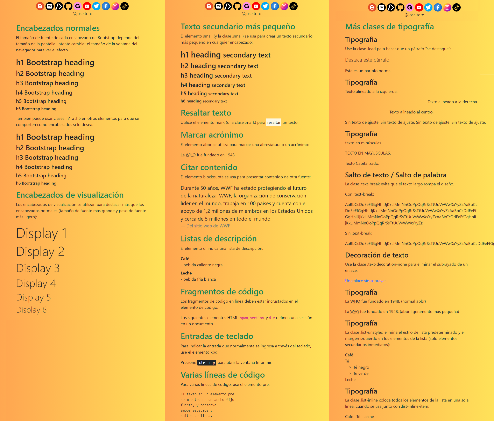

# Bootstrap 5 | Text/Typography

📒 Bootstrap 5 usa un tamaño de fuente predeterminado de 1 rem (16 px por defecto) y su altura de línea es 1.5.

📒 Además, todos los elementos p tienen margin-top: 0 y margin-bottom: 1rem (16px por defecto).

📒 Encabezados normales

    📝 Bootstrap 5 diseña encabezados HTML (<h1> a <h6>) con un peso de fuente más audaz y un tamaño de fuente receptivo.

    <h1>h1 Bootstrap heading</h1>
    <h2>h2 Bootstrap heading</h2>
    <h3>h3 Bootstrap heading</h3>
    <h4>h4 Bootstrap heading</h4>
    <h5>h5 Bootstrap heading</h5>
    <h6>h6 Bootstrap heading</h6>

    📝También puede usar las clases .h1 a .h6 en otros elementos para que se comporten como encabezados si lo desea:

    
h1 Bootstrap heading

    
h2 Bootstrap heading

    
h3 Bootstrap heading

    
h4 Bootstrap heading

    
h5 Bootstrap heading

    
h6 Bootstrap heading

        
📒 Encabezados de visualización

    📝Los encabezados de visualización se utilizan para resaltar más que los encabezados normales (tamaño de fuente más grande y peso de fuente más ligero), y hay seis clases para elegir: .display-1 a .display-6:

    <h1 class="display-1">Display 1</h1>
    <h1 class="display-2">Display 2</h1>
    <h1 class="display-3">Display 3</h1>
    <h1 class="display-4">Display 4</h1>
    <h1 class="display-5">Display 5</h1>
    <h1 class="display-6">Display 6</h1>

📒 Texto secundario más pequeño

    📝 En Bootstrap 5, el elemento HTML <small> (y la clase .small) se usan para crear un texto secundario más pequeño en cualquier encabezado:

    <h1>h1 heading <small>secondary text</small></h1>
    <h2>h2 heading <small>secondary text</small></h2>
    <h3>h3 heading <small>secondary text</small></h3>
    <h4>h4 heading <small>secondary text</small></h4>
    <h5>h5 heading <small>secondary text</small></h5>
    <h6>h6 heading <small>secondary text</small></h6>

📒 Resaltar texto

    📝Bootstrap 5 diseñará <mark> y .mark con un color de fondo amarillo y algo de relleno:    

    
Utilice el elemento mark (o la clase .mark) para <mark>resaltar</mark> un texto.

📒 Abrebiar texto

    📝Bootstrap 5 diseñará el elemento HTML <abbr> con un borde inferior punteado y un cursor con un signo de interrogación al pasar el mouse:

    
La <abbr title="World Health Organization">WHO</abbr> fue fundado en 1948.

📒 Citar contenido

    📝Agregue la clase .blockquote a <blockquote> cuando cite bloques de contenido de otra fuente. Y al nombrar una fuente, como "del sitio web de WWF", use la clase .blockquote-footer:

    <blockquote class="blockquote">
        
Durante 50 años, WWF ha estado protegiendo el futuro de la naturaleza. WWF, la organización de conservación líder en el mundo, trabaja en 100 países y cuenta con el apoyo de 1,2 millones de miembros en los Estados Unidos y cerca de 5 millones en todo el mundo.

        <footer class="blockquote-footer">Del sitio web de WWF</footer>
    </blockquote>

📒 Listas de descripción

    📝Bootstrap 5 diseñará el elemento HTML <dl> de la siguiente manera:

    p>El elemento dl indica una lista de descripción:

    <dl>
        <dt>Café</dt>
        <dd>- bebida caliente negra</dd>
        <dt>Leche</dt>
        <dd>- bebida fría blanca</dd>
    </dl>    

📒 Fragmentos de código

    📝Bootstrap 5 diseñará el elemento HTML <code> de la siguiente manera:

    
Los siguientes elementos HTML: <code>span</code>, <code>section</code>, y <code>div</code> definen una sección en un documento.

📒 Entradas de teclado

    📝Bootstrap 5 diseñará el elemento HTML <kbd> de la siguiente manera:

    
Presione <kbd>ctrl + p</kbd> para abrir la ventana Imprimir.

📒 Varias líneas de código

    📝 Bootstrap 5 diseñará el elemento HTML <pre> de la siguiente manera:

    <pre>
        El texto en un elemento pre
        se muestra en un ancho fijo
        fuente, y conserva
        ambos espacios y
        saltos de línea.
    </pre>

📒 Más clases de tipografía

    📝Las siguientes clases de Bootstrap 5 se pueden agregar para diseñar más elementos HTML:

        🔸 .lead: hace que un párrafo se destaque
        🔸 .text-start: Indica texto alineado a la izquierda
        🔸 .text-center: Indica texto alineado al centro
        🔸 .text-end: Indica texto alineado a la derecha
        🔸 .text-nowrap: Indica que no hay texto de ajuste
        🔸 .text-lowercase: Indica texto en minúsculas
        🔸 .text-uppercase: Indica texto en mayúsculas
        🔸 .text-capitalize: Indica texto en mayúscula
        🔸 .text-break: Evita que el texto largo rompa el diseño
        🔸 .text-decoration-none: Elimina el subrayado de un enlace
        🔸 .initialism: Muestra el texto dentro de un elemento <abbr> en un tamaño de fuente ligeramente más pequeño
        🔸 .list-unstyled: Elimina el estilo de lista predeterminado y el margen izquierdo de los elementos de la lista (funciona tanto en <ul> como en <ol>). Esta clase solo se aplica a los elementos de la lista de elementos secundarios inmediatos (para eliminar el estilo de lista predeterminado de cualquier lista anidada, aplique esta clase también a cualquier lista anidada)
        🔸 .list-inline: Coloca todos los elementos de la lista en una sola línea (se usa junto con .list-inline-item en cada elemento <li>)

Redes sociales:

- https://instagram.com/dev.joseltoro
- https://facebook.com/devjoseltoro
- https://tiktok.com/@dev.joseltoro
- https://dev.to/joseltoro
- https://code.dcoder.tech/profile/joseltoro
- https://joseltoro.blogspot.com/
- https://joseltoro.gumroad.com/